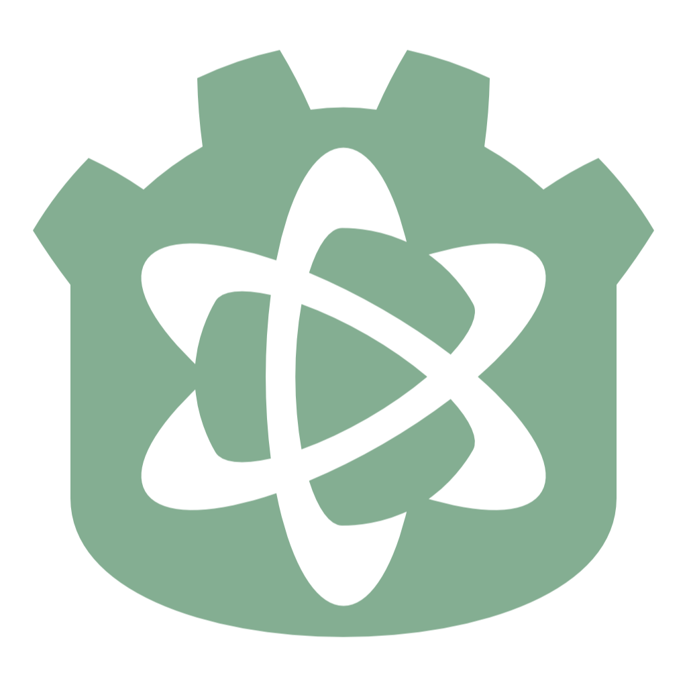

# godot-lore-plugin

An in-editor Godot GDExtension bringing native support for Epic Games' [Lore](https://epicgames.github.io/lore/) source control system, mirroring the UX of Godot's built-in Git integration (the first-party `godot-git-plugin`).

The plugin subclasses Godot's `EditorVCSInterface` and drives it via a vendored snapshot of Lore's C API (`lore-capi`/`lore.h`) — the same integration point Epic's own in-progress VS Code plugin is built against. Lore is linked dynamically (`lore.dll` + a small import lib), not statically: the raw staticlib archive `cargo`/`cbindgen` also produce is unlinked and runs into the hundreds of MB to multiple GB (no dead-code elimination happens until something actually links against it), whereas the `cdylib` build is already linked and stripped down to ~30MB. `lore.dll` ships alongside the extension's own DLL as a genuine runtime dependency.

Status: core functionality in place and verified — status, diff, stage/unstage/discard, commit, branch list/current/checkout/create/remove, and push/pull against a real server. See "What works" and "Known limitations" below.

## Repository layout

```
CMakeLists.txt                  Top-level build, targets the "editor" godot-cpp configuration
src/                            GDExtension C++ source
  lore_ffi/                     Thin C++ wrapper bridging lore-capi's async API to synchronous calls
  lore_vcs_plugin.*             LoreVCSPlugin : EditorVCSInterface, the actual VCS plugin
tests/lore_ffi_test.cpp         Standalone console regression harness for lore_ffi (no Godot involved)
third_party/godot-cpp/          Submodule: C++ bindings for Godot's GDExtension API
third_party/lore/               Vendored snapshot: lore.h + lore.dll.lib + lore.dll (see tools/update-lore-snapshot.ps1)
addons/godot-lore-plugin/       Standard Godot addon layout (this is what would ship)
tools/update-lore-snapshot.ps1  Rebuilds third_party/lore/ from a local Lore checkout
```

## Installing the addon

1. Copy the `addons/godot-lore-plugin/` folder into your Godot project's `addons/` directory (Windows only for now).
2. Make sure a Lore repository (a `.lore` folder) exists at your **project's root directory** — the same folder as `project.godot`. Lore doesn't search upward for `.lore` the way Git searches for `.git`, so it has to be exactly there.
3. In the editor: **Project → Version Control → Version Control Settings...**, select **LoreVCSPlugin**, and connect.

## What works

- Status of staged / unstaged / conflict state and working-tree diff, in the Commit dock and diff panel
- Stage, unstage, and discard changes (discarding a never-committed file removes it entirely, matching Git's plugin behavior)
- Commit, with message
- Branch list, current branch, checkout, create, and remove (archive — Lore has no true branch delete)
- Push and pull against the repository's configured remote

## Known limitations

These aren't bugs — they're either genuine gaps in what Lore's API offers versus Git, or scope not built out yet:

- **No commit history view or per-commit diffing.** The Commit dock's history list stays empty; diffing only works against the current working tree, not an arbitrary past revision.
- **No commit amend.** Lore's `amend` operation is currently limited to message-only changes.
- **No credential/auth UI wiring.** The setup dialog's username/password/SSH fields don't do anything. This works today with a repository that's already authenticated (e.g. via the `lore` CLI, or an unauthenticated local server) — logging in through the editor itself isn't wired up.
- **No "Fetch" button behavior.** Lore's `sync` operation always fetches *and* integrates in one step — there's no Git-style fetch-without-merging to map a separate Fetch action onto, so it's a no-op rather than a surprise full sync.
- **One remote, no "Create/Remove Remote."** Lore has a single server configured per repository, not Git's list of named remotes, so those dock actions are no-ops.

## Prerequisites

- CMake 3.19+
- An MSVC toolchain (Visual Studio Build Tools) — Windows is the only supported platform for now
- A Godot 4.3+ editor binary and a project to load the addon into, so the extension is tested against the exact `EditorVCSInterface` API surface it was built for (see "Testing" below)
- Rust + Cargo, only if you need to refresh the vendored Lore snapshot via `tools/update-lore-snapshot.ps1`

## Building

```powershell
git submodule update --init --recursive

cmake -B build -DCMAKE_BUILD_TYPE=Release
cmake --build build --config Release
```

This produces `addons/godot-lore-plugin/bin/godot-lore-plugin.windows.editor.x86_64.dll` (referenced by `addons/godot-lore-plugin/godot-lore-plugin.gdextension`) plus a copy of `lore.dll` alongside it, since the extension DLL depends on it at load time.

## Testing

Two levels:

- `tests/lore_ffi_test.cpp` (built as `lore_ffi_test`) exercises the `lore_ffi` wrapper directly against a real local Lore repository, no Godot involved — the fastest way to check a change to `src/lore_ffi/` before touching the editor. Run it with no arguments for status/diff, or see its header comment for the `--write-ops-demo`/`--discard-demo`/`--branch-demo`/`--push-demo`/`--pull-demo` regression modes.
- For the real thing, create or open a Godot 4.3+ project with the addon installed (see "Installing the addon" above) and a `.lore` repository at its root (Lore doesn't search upward for one the way Git does), then: **Project → Version Control → Version Control Settings...**, select `LoreVCSPlugin`, connect.

## Updating the vendored Lore snapshot

`third_party/lore/` is a point-in-time snapshot, not a live build of the Lore checkout. Refresh it with:

```powershell
tools/update-lore-snapshot.ps1
```

This assumes a sibling checkout of the Lore repository; pass `-LoreRepoPath` to override.

## License

MIT — see `LICENSE`. Bundles [godot-cpp](https://github.com/godotengine/godot-cpp) (statically linked) and [Lore](https://github.com/EpicGames/lore)'s client library (`lore.dll`, loaded at runtime), both also MIT — see `THIRDPARTY.md`.
