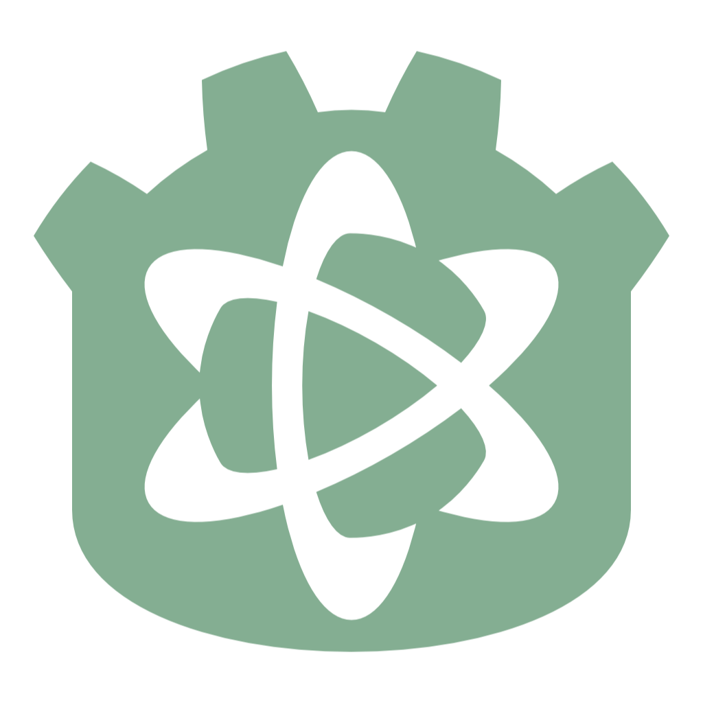

# godot-lore-plugin

An in-editor Godot GDExtension bringing native support for Epic Games' [Lore](https://epicgames.github.io/lore/) source control system, mirroring the UX of Godot's built-in Git integration (the first-party `godot-git-plugin`).

The plugin subclasses Godot's `EditorVCSInterface` and drives it via Lore's C API (`lore-capi`/`lore.h`), built from a pinned `third_party/lore` submodule checkout. Lore is linked dynamically, not statically: the raw staticlib archive `cargo`/`cbindgen` also produce is unlinked and runs into the hundreds of MB to multiple GB (no dead-code elimination happens until something actually links against it), whereas the `cdylib` build is already linked and stripped down to a few dozen MB. Lore's shared library — `lore.dll` (+ a small import lib) on Windows, `liblore.so` on Linux, `liblore.dylib` on macOS — ships alongside the extension's own shared library as a genuine runtime dependency.

## Repository layout

```
CMakeLists.txt                  Top-level build, targets the "editor" godot-cpp configuration
src/                            GDExtension C++ source
  lore_ffi/                     Thin C++ wrapper bridging lore-capi's async API to synchronous calls
  lore_vcs_plugin.*             LoreVCSPlugin : EditorVCSInterface, the actual VCS plugin
tests/lore_ffi_test.cpp         Standalone console regression harness for lore_ffi (no Godot involved)
third_party/godot-cpp/          Submodule: C++ bindings for Godot's GDExtension API
third_party/lore/               Submodule: Lore source, built via cargo by CMake (see "Building")
addons/godot-lore-plugin/       Standard Godot addon layout (this is what would ship)
```

## Installing the addon

1. Copy the `addons/godot-lore-plugin/` folder into your Godot project's `addons/` directory. Prebuilt binaries for Windows, Linux, and macOS (universal x86_64/arm64) all ship in the same folder — Godot picks the right one for the running platform via `godot-lore-plugin.gdextension`.
2. Make sure a Lore repository (a `.lore` folder) exists at your **project's root directory** — the same folder as `project.godot`. Lore doesn't search upward for `.lore` the way Git searches for `.git`, so it has to be exactly there.
3. In the editor: **Project → Version Control → Version Control Settings...**, select **LoreVCSPlugin**, and connect.

## What works

- Status of staged / unstaged / conflict state and working-tree diff, in the Commit dock and diff panel
- Stage, unstage, and discard changes (discarding a never-committed file removes it entirely, matching Git's plugin behavior)
- Commit, with message
- Commit history list (message, author, date) and per-commit changed files & patch contents (the repository's initial commit does not contain patch details)
- Branch list, current branch, checkout, create, and remove (archive — Lore has no true branch delete)
- Push and pull against the repository's configured remote

## Known limitations

These aren't bugs — they're either genuine gaps in what Lore's API offers versus Git, or scope not built out yet:

- **No commit amend.** Lore's `amend` operation is currently limited to message-only changes.
- **No credential/auth UI wiring.** The setup dialog's username/password/SSH fields don't do anything. This works today with a repository that's already authenticated (e.g. via the `lore` CLI, or an unauthenticated local server) — logging in through the editor itself isn't wired up.
- **No "Fetch" button behavior.** Lore's `sync` operation always fetches *and* integrates in one step — there's no Git-style fetch-without-merging to map a separate Fetch action onto, so it's a no-op rather than a surprise full sync.
- **One remote, no "Create/Remove Remote."** Lore has a single server configured per repository, not Git's list of named remotes, so those dock actions are no-ops.

## Prerequisites

- CMake 3.19+
- A native C++ toolchain for your platform: MSVC (Visual Studio Build Tools) on Windows, GCC or Clang on Linux, or the Xcode Command Line Tools (Clang) on macOS
- A Godot 4.3+ editor binary and a project to load the addon into, so the extension is tested against the exact `EditorVCSInterface` API surface it was built for (see "Testing" below)
- Rust + Cargo (rustc 1.91 or newer — Lore's crate dependencies require it, and an older toolchain fails mid-build with a raw `cargo` MSRV error; `rustup update stable` gets you there) — CMake builds Lore's C API from the `third_party/lore` submodule as part of the build; the first build needs network access to fetch its crate dependencies. On macOS, also install both Darwin targets (`rustup target add x86_64-apple-darwin aarch64-apple-darwin`): by default the build produces a genuine universal binary (see "Building" below), and cargo only ever builds for one target at a time.

## Building

```
git submodule update --init --recursive

cmake -B build -DCMAKE_BUILD_TYPE=Release
cmake --build build --config Release
```

These commands are the same on every platform. They produce a per-platform subfolder under `addons/godot-lore-plugin/` (referenced by `addons/godot-lore-plugin/godot-lore-plugin.gdextension`), plus a copy of Lore's shared library alongside the extension binary, since the extension depends on it at load time:

- Windows: `addons/godot-lore-plugin/windows/godot-lore-plugin.windows.editor.x86_64.dll` + `lore.dll`
- Linux: `addons/godot-lore-plugin/linux/godot-lore-plugin.linux.editor.x86_64.so` + `liblore.so`
- macOS: `addons/godot-lore-plugin/macos/godot-lore-plugin.macos.editor.universal.dylib` + `liblore.dylib` — a genuine universal (x86_64 + arm64) binary by default; CMake builds the Lore crate once per architecture via `cargo` and merges the results with `lipo`

Along the way, CMake builds Lore's shared library (plus header, plus, on Windows, a `.lib` import library) from `third_party/lore` via `cargo` and stages them under `build/lore/` — there's no separate step for this.

Building regenerates a handful of files tracked inside `third_party/lore` itself (codegen'd proto bindings, `lore-capi/lore.h`), so `git status` may show the submodule as having local modifications after a build. These are build byproducts, not something to commit — `git -C third_party/lore checkout -- .` clears them.

## Testing

Two levels:

- `tests/lore_ffi_test.cpp` (built as `lore_ffi_test`) exercises the `lore_ffi` wrapper directly against a real local Lore repository, no Godot involved — the fastest way to check a change to `src/lore_ffi/` before touching the editor. Run it with no arguments for status/diff, or see its header comment for the `--write-ops-demo`/`--discard-demo`/`--branch-demo`/`--push-demo`/`--pull-demo` regression modes.
- For the real thing, create or open a Godot 4.3+ project with the addon installed (see "Installing the addon" above) and a `.lore` repository at its root (Lore doesn't search upward for one the way Git does), then: **Project → Version Control → Version Control Settings...**, select `LoreVCSPlugin`, connect.

## Updating the Lore version

`third_party/lore` is a submodule pinned to a specific Lore commit. To bump it:

```
git -C third_party/lore fetch
git -C third_party/lore checkout <ref>
git add third_party/lore
```

The next build picks up the new pin automatically — no separate vendoring step.

## Updating the godot-cpp version

`third_party/godot-cpp` is a submodule pinned to a specific godot-cpp commit, which should track the Godot editor version the plugin is built against. To bump it:

```
git -C third_party/godot-cpp fetch
git -C third_party/godot-cpp checkout <ref>
git add third_party/godot-cpp
```

The next build picks up the new pin automatically — no separate vendoring step.

## Changing the target Godot API version

`GODOTCPP_API_VERSION` in the top-level `CMakeLists.txt` sets the oldest Godot API godot-cpp builds against, currently `"4.3"` — chosen because every `EditorVCSInterface` virtual this plugin implements (status/diff/stage/commit/branch/push/pull) plus `FileAccess` is already present as of 4.3, so pinning any lower buys nothing. Raising it lowers compatibility with older editors; lowering it only makes sense if the plugin stops using an API surface newer than whatever floor you pick.

If you change it, also update `compatibility_minimum` in `addons/godot-lore-plugin/godot-lore-plugin.gdextension` to match — the two are meant to stay in sync.

## License

MIT — see `LICENSE`. Bundles [godot-cpp](https://github.com/godotengine/godot-cpp) (statically linked) and [Lore](https://github.com/EpicGames/lore)'s client library (`lore.dll` / `liblore.so` / `liblore.dylib`, loaded at runtime), both also MIT — see `THIRDPARTY.md`.
